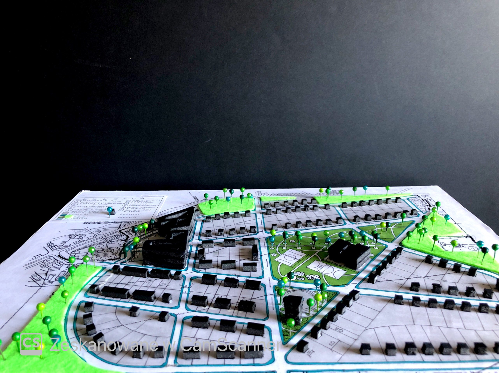

# Aleksandra Nowak

Jestem studentką pierwszego roku architektury na Politechnice Łódzkiej. Cechuje mnie dobra organizacja i motywacja do pracy. Chętnie poznaję nowe osoby i podejmuje ciekawe wyzwania, tym samym rozwijając się i ucząc wciąż nowych rzeczy.

W pracy przykładam uwagę do szczegółów i kieruję się wrodzonym zmysłem artystycznym, który łączę z technicznymi aspektami poznanymi podczas studiów.

## Technologie

Poniżej przedstawiam technologie, którymi posługuję się na co dzień podczas studiów:

## Projekty

  

    
    
<small>Cola</small>

  

  

    
    
<small>Kapsuła</small>

  

  

    
    
<small>Klauzura</small>

  

  

    
    
<small>Kompozycja</small>

  

  

    
    
<small>Makieta</small>

  

  

    
    
<small>Makieta 1</small>

  

  

    
    
<small>Makieta 2</small>

  

  

    
    
<small>Makieta 3</small>

  

  

    
    
<small>Makieta 4</small>

  

  

    
    
<small>Obraz tancerka</small>

  

  

    
    
<small>Obrazy</small>

  

  

    
    
<small>Ogród</small>

  

  

    
    
<small>Portret</small>

  

  

    
    
<small>Przystanek</small>

  

  

    
    
<small>Rysunki</small>

  

