# Aleksandra Nowak

Jestem studentką pierwszego roku architektury na Politechnice Łódzkiej. Cechuje mnie dobra organizacja i motywacja do pracy. Chętnie poznaję nowe osoby i podejmuje ciekawe wyzwania, tym samym rozwijając się i ucząc wciąż nowych rzeczy.

W pracy przykładam uwagę do szczegółów i kieruję się wrodzonym zmysłem artystycznym, który łączę z technicznymi aspektami poznanymi podczas studiów.

## Technologie

Poniżej przedstawiam technologie, którymi posługuję się na co dzień podczas studiów:

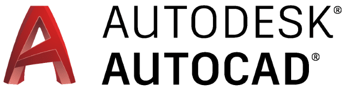

## Projekty

  

    
    
<small>Projekt strefy wejściowej do ogrodu botanicznego w Łodzi</small>

  

  

    
    
<small>Projekt przystanku komunikacji miejskiej przy placu Niepodległości w Łodzi</small>

  

   

    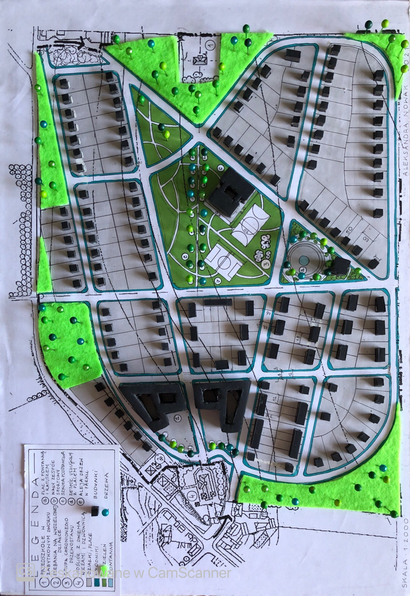
    
<small>Projekt zabudowy śródmiejskiej</small>

  

   

    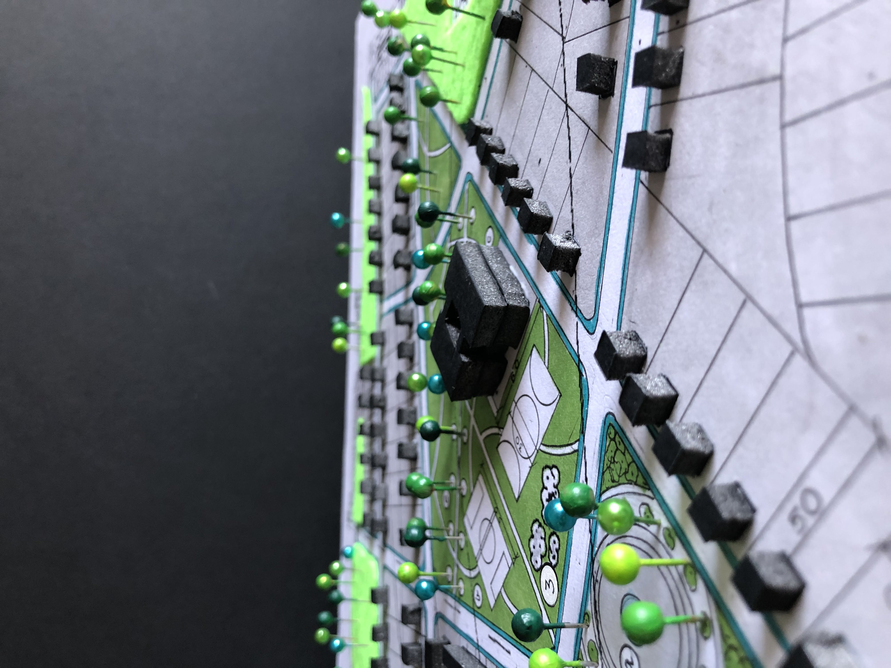
    
<small></small>

  

  

    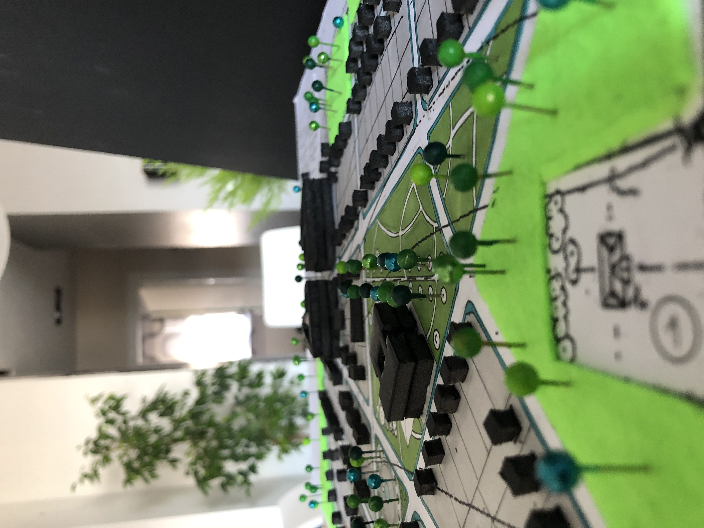
    
<small></small>

  

  

    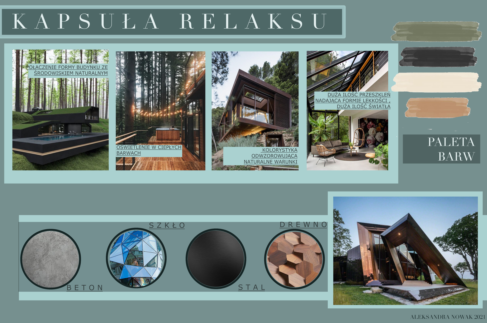
    
<small>Moodboard do projektu kapsuła relaksu</small>

  

   

    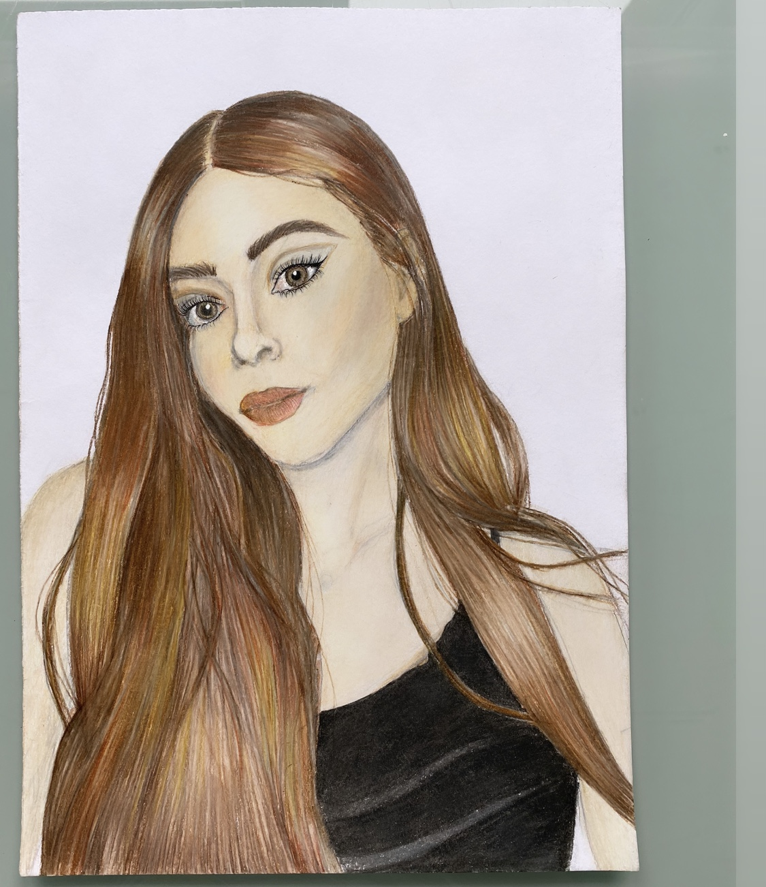
    
<small>Autoportret- kredki ołówkowe</small>

  

  

    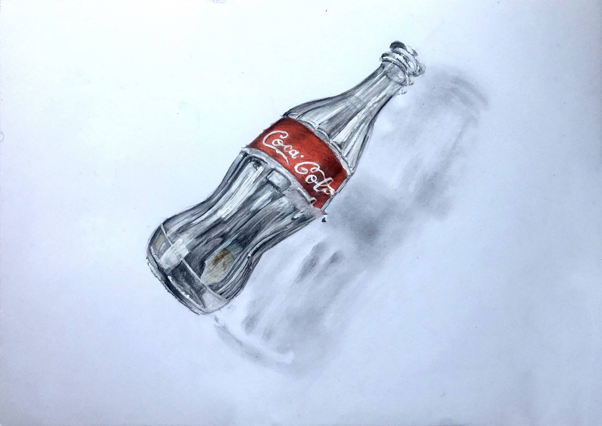
    
<small>Rysunek Cola- kredki ołówkowe</small>

  

  
  

    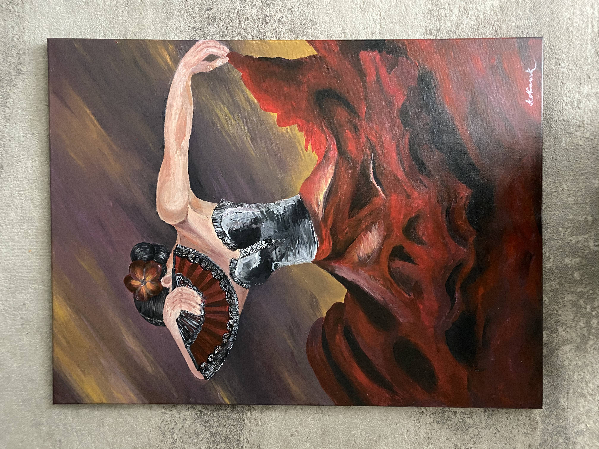
    
<small>Obraz technika akrylowa</small>

  

  

    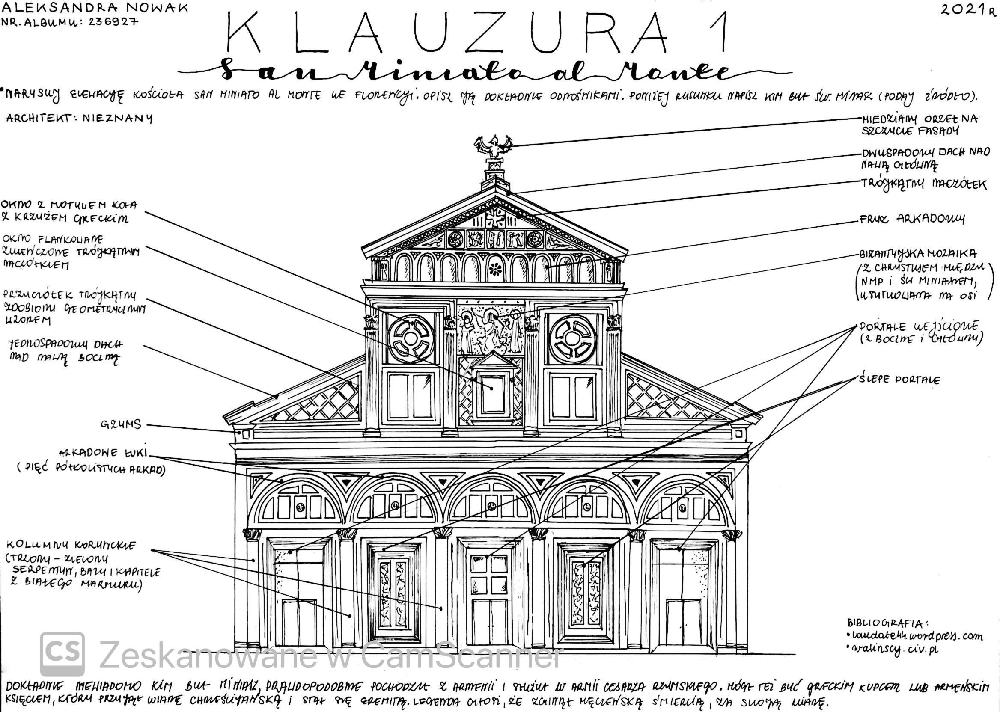
    
<small>Elewacja San Miniato al Monte</small>

  

    

    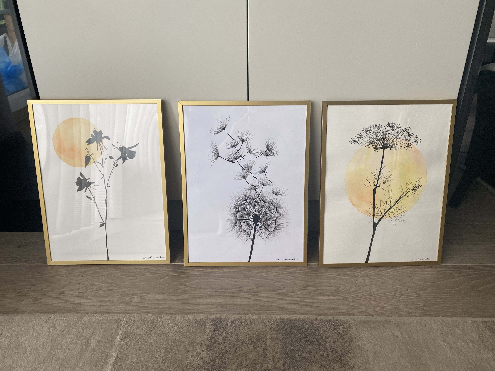
    
<small>Plakaty- akwarela i cienkopis</small>

  

  

    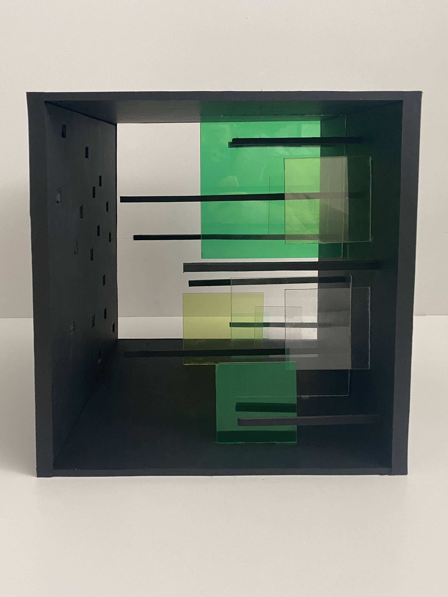
    
<small>Kompozycja plastyczna</small>

  

   

    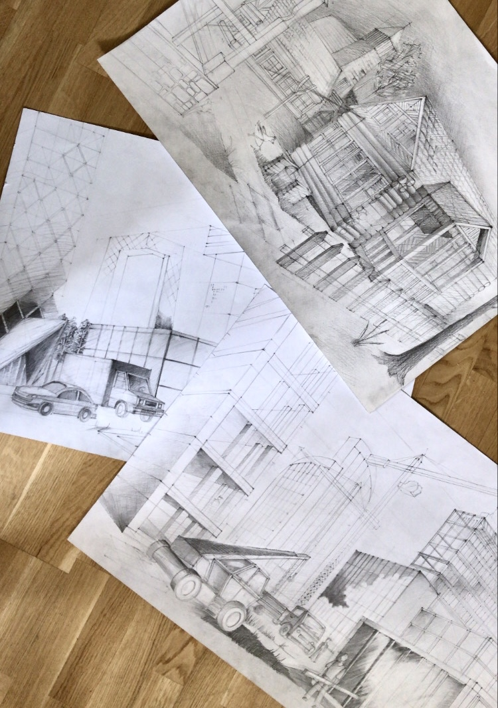
    
<small>Rysunki-ołówek</small>

  

  

    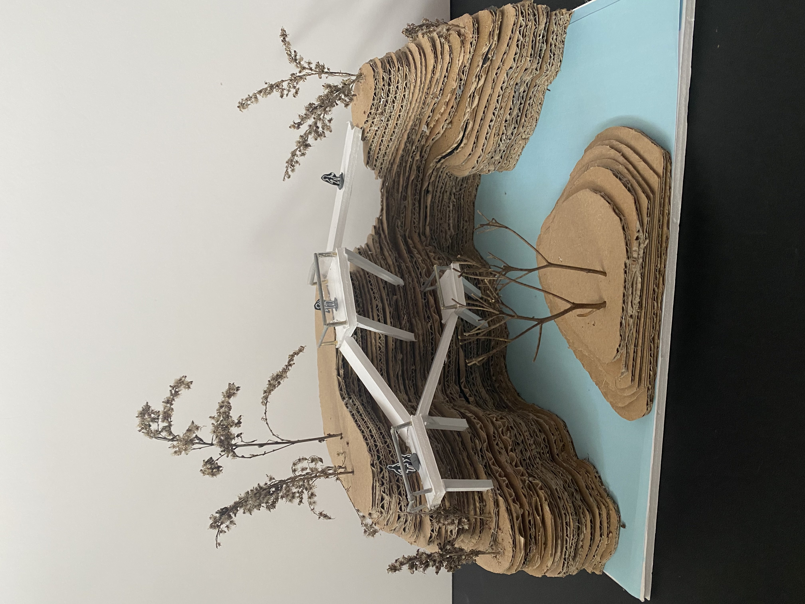
    
<small>Makieta punktu widokowego</small>

  

